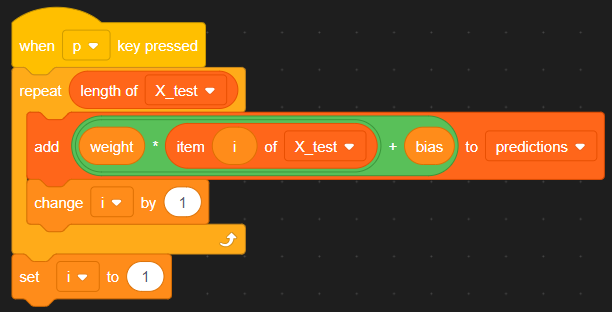

# Linear Regression in Scratch

## Overview

This is a very simple linear regression model implemented using block programming in scratch. The scratch project is available [here](https://scratch.mit.edu/projects/1226182097), and you can download the project from this repo.

## Project Controls
The project uses the following buttons for control
* `space` - run a singular epoch of training (you can hold down to iterate)
* `e` - load example data and learning rate
* `p` - predict test data with curent weight and bias
* `r` - reset all variables to default

## Code Explanation

The full code looks like:

As you can see there are five steps to our code, the are as follows:

#### 1. Start

This is what runs when you start the project by pressing the green flag button. It doesn't do much, it only hides some variables from the screen to make it more presentable.

#### 2. Reset

This is what resets the project, and you run it by pressing `r`. All this code block does is reset all the variables to their default values.

#### 3. Example

This sets up the example data and parameters. It fills in the lists `X_train`, `X_test`, and `y_train` with data corresponding to the linear equation `y = 5x`.

#### 4. Train

This is the most exciting code block. It trains the model, one epoch at a time. It starts by iterating through `X_train` to update weights based on each sample. It then predicts the output for that sample using the current weights and bias. Next it calculates the gradients of the weight and bias. Finally, it updates the weight and bias using gradient descent.

#### 5. Predict

This code block predicts each sample in `X_test` using the weight and bias learned while training, it then saves these predictions to a list.
